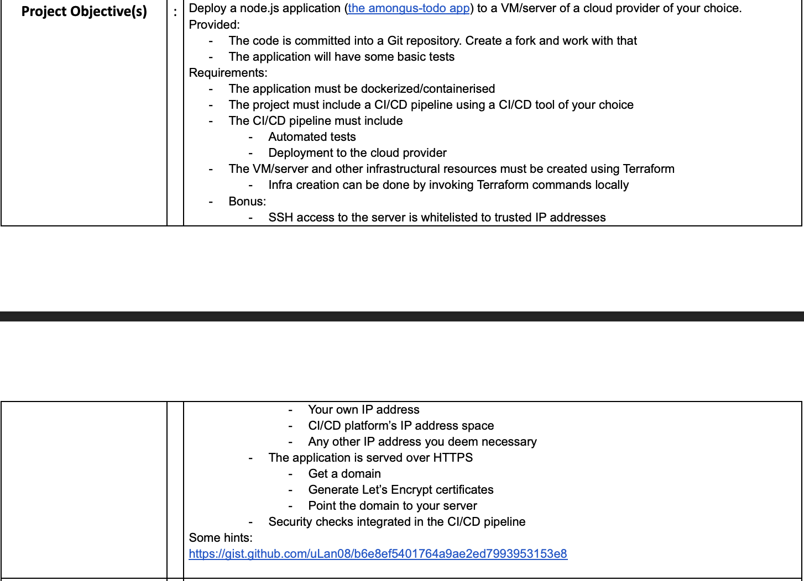
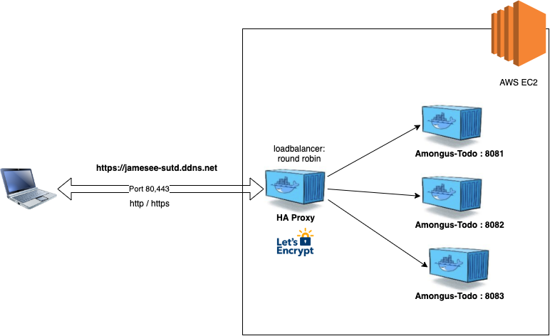

# DevTools Capstone



# Requirements

# Requirement #1
- The application must be dockerized/containerised
- The project must include a CI/CD pipeline using a CI/CD tool of your choice
- The CI/CD pipeline must include
- Automated tests
- Deployment to the cloud provider


Whenever there is a push to main branch, it will do the integration test of the app and the synk vulnerability test. Upon success, it will build the docker image james1122/amongus-todo:latest (based on the Dockfile in the project root), does the docker synk test and then push to docker hub james1122 registry. After that, I use ansible ([based on the ansible/app/amongus-todo.yml](ansible/app/amongus-todo.yml)) to redeploy the docker app at the AWS EC2 server.

```yaml
# .github/workflows/deploy-amongus-todo-ec2.yml
name: CI for Amongus-todo app to AWS EC2 via Dockerhub
on:
  push:
    branches: [main]

env:
  IMAGE_NAME: amongus-todo
  TEST_TAG: ${{ secrets.DOCKER_HUB_USERNAME }}/amongus-todo:test
  RELEASE_TAG: ${{ secrets.DOCKER_HUB_USERNAME }}/amongus-todo:lastest
  # EMAIL: james.ee.developer@gmail.com

jobs:
  npm-tests:
    runs-on: ubuntu-latest
    steps:
      - uses: actions/checkout@v2
      - uses: actions/setup-node@v2
        with:
          node-version: '14'
      - name: Cache dependencies
        id: cache-step
        uses: actions/cache@v2
        with:
          path: ~/.npm
          key: v1-node-dependencies-${{ hashFiles('./package-lock.json') }}
          restore-keys: v1-node-dependencies-
      - name: Install dependencies
        run: npm ci
      - name: Run tests
        run: npm test

  snyk-scan:
    needs: npm-tests
    runs-on: ubuntu-latest
    steps:
      - uses: actions/checkout@v2
      - name: Run Snyk to check for vulnerabilities
        uses: snyk/actions/node@master
        env:
          SNYK_TOKEN: ${{ secrets.SNYK_TOKEN }}

  docker-build-snyk:
    needs: [ npm-tests, snyk-scan ]
    runs-on: ubuntu-latest
    steps:
      - name: Checkout
        uses: actions/checkout@v2

      - name: Set up QEMU
        uses: docker/setup-qemu-action@v1

      - name: Set up Docker Buildx
        uses: docker/setup-buildx-action@v1

      - name: Build and export to Docker
        uses: docker/build-push-action@v2
        with:
          context: .
          load: true
          tags: ${{ env.TEST_TAG }}

      - name: Run Snyk to check Docker images for vulnerabilities
        uses: snyk/actions/docker@master
        env:
          SNYK_TOKEN: ${{ secrets.SNYK_TOKEN }}
        with:
          image: ${{ env.TEST_TAG }}
          args: --severity-threshold=high
          
  docker-push:
    needs: docker-build-snyk
    runs-on: ubuntu-latest
    steps:
      - name: Checkout
        uses: actions/checkout@v2

      - name: Set up QEMU
        uses: docker/setup-qemu-action@v1

      - name: Set up Docker Buildx
        uses: docker/setup-buildx-action@v1

      - name: Login to DockerHub
        uses: docker/login-action@v1
        with:
          username: ${{ secrets.DOCKER_HUB_USERNAME }}
          password: ${{ secrets.DOCKER_HUB_ACCESS_TOKEN }}

      - name: Build and push
        id: docker_build
        uses: docker/build-push-action@v2
        with:
          context: .
          platforms: linux/amd64
          push: true
          tags: ${{ env.RELEASE_TAG }}

      - name: Image digest
        run: |
          echo ${{ steps.docker_build.outputs.digest }}

  deploy-app:
    needs: docker-push
    runs-on: ubuntu-latest
    steps:
    - uses: actions/checkout@v1
    - uses: ./.github/actions/ansible
      with: 
        key: ${{ secrets.SSH_PRIVATE_KEY }}
        playbook: ./ansible/app/amongus-todo.yml
        inventory: ./ansible/inventory.ini
```

```yaml
# ansible/app/amongus-todo.yml
---
- hosts: all
  become: true
  vars:
    create_containers: 3
    default_container_name: Amongus-Todo
    default_container_image: james1122/amongus-todo:latest
    default_container_command: sleep 1d

  tasks:
    - name: Install aptitude using apt
      apt: name=aptitude state=latest update_cache=yes force_apt_get=yes

    - name: Install required system packages
      apt: name={{ item }} state=latest update_cache=yes
      loop: [ 'apt-transport-https', 'ca-certificates', 'curl', 'software-properties-common', 'python3-pip', 'virtualenv', 'python3-setuptools']

    - name: Add Docker GPG apt Key
      apt_key:
        url: https://download.docker.com/linux/ubuntu/gpg
        state: present

    - name: Add Docker Repository
      apt_repository:
        repo: deb https://download.docker.com/linux/ubuntu xenial stable
        state: present

    - name: Update apt and install docker-ce
      apt: update_cache=yes name=docker-ce state=latest

    - name: Install Docker Module for Python
      pip:
        name: docker

    - name: Pull default Docker image
      docker_image:
        name: "{{ default_container_image }}"
        tag : latest
        source: pull

    - name: remove all docker containers
      shell: docker rm -f $(docker ps -a -q)
      ignore_errors: true

    - name: Run docker container
      docker_container:
        name: "{{ default_container_name }}{{ item }}"
        image: "{{ default_container_image }}"
        state: started
        exposed_ports:
        - "808{{item}}"
        ports:
        - "808{{ item }}:3000"
        # volumes:
        # - /root/webpage/:/usr/local/apache2/htdocs/
      with_sequence: count={{ create_containers }}
```

# Requirement #2 

- The VM/server and other infrastructural resources must be created using Terraform
- Infra creation can be done by invoking Terraform commands locally

Please see the hcl scripts in [terraform](terraform) folders. 

Managed to use terraform to setup the ec2 at AWS and use [ansible docker.yml](ansible/infra/docker.yml) to install docker engine after it has been set up.

The terraform HCL script automatically output the [inventory.ini](ansilbe/inventory.ini) file for ansbile consumption.

Also, as I could not find suitable ansible github actions at the marketplace, I wrote my ansible github actions. Please see [.github/actions/ansible](.github/actions/ansible) folder.

# Bonus Requirement

- The application is served over HTTPS
- Get a domain
- Generate Let’s Encrypt certificates
- Point the domain to your server

Manually set up a reverse-proxy server using HAProxy with loadbalancing and https using letsencrypt certificate.

Please see https://jamesee-sutd.ddns.net

