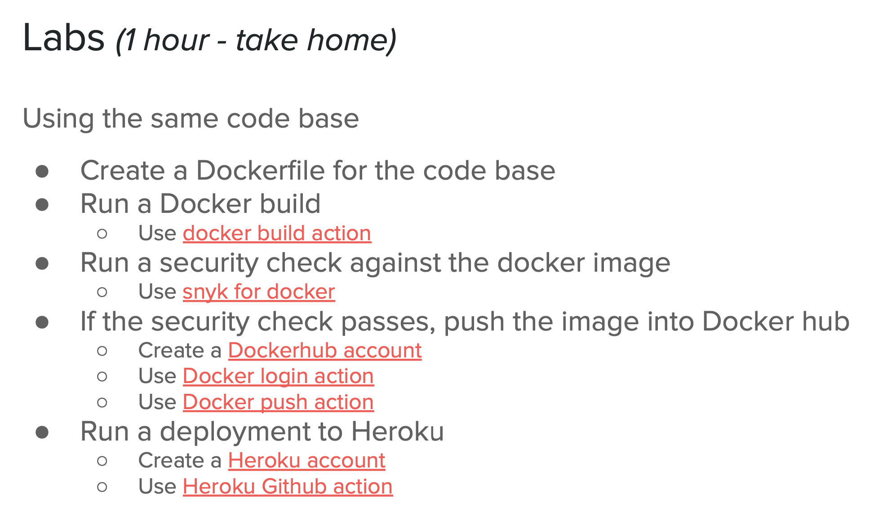

# DevTools Homework Day 3



```yaml
# .github/workflows/docker.yml

name: CI to Docker Hub
on:
  push:
    branches: [master]

env:
  IMAGE_NAME: amongus-todo
  TEST_TAG: ${{ secrets.DOCKER_HUB_USERNAME }}/amongus-todo:test
  RELEASE_TAG: ${{ secrets.DOCKER_HUB_USERNAME }}/amongus-todo:lastest
  EMAIL: james.ee.developer@gmail.com

jobs:
  npm-tests:
    runs-on: ubuntu-latest
    steps:
      - uses: actions/checkout@v2
      - uses: actions/setup-node@v2
        with:
          node-version: '14'
      - name: Cache dependencies
        id: cache-step
        uses: actions/cache@v2
        with:
          path: ~/.npm
          key: v1-node-dependencies-${{ hashFiles('./package-lock.json') }}
          restore-keys: v1-node-dependencies-
      - name: Install dependencies
        run: npm ci
      - name: Run tests
        run: npm test

  snyk-scan:
    needs: npm-tests
    runs-on: ubuntu-latest
    steps:
      - uses: actions/checkout@v2
      - name: Run Snyk to check for vulnerabilities
        uses: snyk/actions/node@master
        env:
          SNYK_TOKEN: ${{ secrets.SNYK_TOKEN }}

  docker-build-snyk:
    needs: [ npm-tests, snyk-scan ]
    runs-on: ubuntu-latest
    steps:
      - name: Checkout
        uses: actions/checkout@v2

      - name: Set up QEMU
        uses: docker/setup-qemu-action@v1

      - name: Set up Docker Buildx
        uses: docker/setup-buildx-action@v1

      - name: Build and export to Docker
        uses: docker/build-push-action@v2
        with:
          context: .
          load: true
          tags: ${{ env.TEST_TAG }}

      - name: Run Snyk to check Docker images for vulnerabilities
        uses: snyk/actions/docker@master
        env:
          SNYK_TOKEN: ${{ secrets.SNYK_TOKEN }}
        with:
          image: ${{ env.TEST_TAG }}
          args: --severity-threshold=high
          
  docker-push:
    needs: docker-build-snyk
    runs-on: ubuntu-latest
    steps:
      - name: Checkout
        uses: actions/checkout@v2

      - name: Set up QEMU
        uses: docker/setup-qemu-action@v1

      - name: Set up Docker Buildx
        uses: docker/setup-buildx-action@v1

      - name: Login to DockerHub
        uses: docker/login-action@v1
        with:
          username: ${{ secrets.DOCKER_HUB_USERNAME }}
          password: ${{ secrets.DOCKER_HUB_ACCESS_TOKEN }}

      - name: Build and push
        id: docker_build
        uses: docker/build-push-action@v2
        with:
          context: .
          platforms: linux/amd64
          push: true
          tags: ${{ env.RELEASE_TAG }}

      - name: Image digest
        run: |
          echo ${{ steps.docker_build.outputs.digest }}

  heroku-deploy:
    needs: docker-build-snyk
    runs-on: ubuntu-latest
    steps:
      - uses: actions/checkout@v2
      - uses: akhileshns/heroku-deploy@v3.12.12 # This is the action
        with:
          heroku_api_key: ${{secrets.HEROKU_API_KEY}}
          heroku_app_name: jamesee-${{ env.IMAGE_NAME }} #Must be unique in Heroku
          heroku_email: ${{ env.EMAIL }}
          usedocker: true
```

# Deployed to Heroku

The URL to Heroku deployment : https://jamesee-amongus-todo.herokuapp.com/


# Among Us TODOs API


Fake REST API server of tasks from Among Us

## Getting Started

This application is backed by the default data from a json file (default to be `db.json`, however it can be specified through an environment variable).
The underlying server that power the application is [json-server](https://github.com/typicode/json-server)

### Starting the application

Simply `npm start` and the server will be started with the default configurations on port 3000 and db file to be `db.json`

### App-level configurations

- `DB`: path to the json file that will be used as the database
- `PORT`: port that the app will start on

### Testing

- Code linting: `npm run lint`
- Full test suite: `npm test`

## API Reference

Data from the json database file will be loaded every time the app starts and db writes will be made to the same file as well. Hence, a note on if the data is not commited into source, we might see differences between environments.

Listed below are basic usages of the API, more advanced usages can be found [here](https://github.com/typicode/json-server#routes).

### POST /todos

Create a new tasks

```
POST /todos

{
    text: string,
    type: "short" | "long" | "common"
}
```

### GET /todos/:id

Get task by ID

```
GET /todos/:id
```

### GET /todos

Get tasks

```
GET /todos
```

Possible query parameters:

- `q`: full text search
- `_page` and `_limit`: paginate
- any fields from the TODO object: filter using specific fields
- `_start` and `_end`: slice based on TODO ID

### PUT /todos/:id

Replace whole TODO item content

```
PUT /todos/:id

{
    text: string,
    type: "common" | "long" | "short"
}
```

### PATCH /todos/:id

Partial update TODO item

```
PATCH /todos/:id

{
    text?: string,
    type?: "common" | "long" | "short"
}
```

### DELETE /todos/:id

Delete a TODO item

```
DELETE /todos/:id
```

## Contributing

For any requests, bug or comments, please [open an issue](https://github.com/stanleynguyen/amongus-todo/issues) or [submit a pull request](https://github.com/stanleynguyen/amongus-todo/pulls).
